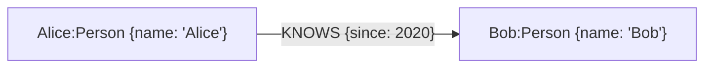

# Neo4J 简单应用

## 一、什么是知识图谱

**知识图谱（Knowledge Graph, KG）** 源于自然语言理解，其目标是用一种结构化的方式，来描述现实世界中的实体及其相互关系。它主要由两个核心要素构成：

1.  **节点（Nodes）**：代表现实世界中的“实体”（Entities），例如一个人、一部电影、一家公司或一个具体概念。
2.  **边（Edges）**：代表实体与实体之间的“关系”（Relations）。

这些元素共同构成了一个庞大的语义网络，其基本结构可以表示为 **（实体）- [关系] -> （实体）** 的三元组（Triples）。例如，“饺子”和“哪吒2”是两个实体，“导演”就是它们之间的关系，构成一个知识三元组：（饺子）- [导演] -> （哪吒2）。

## 二、知识图谱的应用

知识图谱并非一个孤立的学术概念，它在工业界有着广泛且深入的应用，尤其是在需要深度结合领域知识的场景中。

### 2.1 风险识别与网络分析

俗话说“近朱者赤，近墨者黑”，在许多领域，一个实体的风险或属性，往往与其关联的其他实体有很强的相关性。知识图谱正是挖掘这种关联性的利器。

-   **犯罪网络侦查**：公安部门可以利用通话记录、社交关系、转账流水等信息构建犯罪嫌疑人网络。在这个网络中，如果某个节点与多个已知的犯罪分子有直接或间接的联系，那么他参与犯罪的可能性就大大增加。通过分析网络中的核心人物（连接数最多的节点）和资金流向，可以有效地打击整个犯罪团伙。
-   **信用卡反欺诈**：银行可以将申请人的信息（如电话、地址、公司）构建成一个庞大的关系网络。通过分析这张网络，可以识别出“欺诈团伙”——例如，多个申请人共享同一个联系电话或家庭住址，或者与已知的欺诈分子有紧密的社交关系。

### 2.2 智能诊断与运维

-   **工业设备运维**：将设备的各种“故障现象”、“故障原因”、“解决方案”和“所需零件”构建成知识图谱。当设备出现问题时，系统可以根据上报的现象，在图谱中进行推理，快速定位可能的原因，并给出维修建议，甚至可以提示维修人员需要携带哪些工具和备件，从而提高维修效率。
-   **医疗辅助诊断**：医疗领域知识繁杂，可以通过构建“病症”、“疾病”、“检查项目”、“治疗方案”、“药品”之间的关系图谱。医生输入患者的症状后，系统可以辅助推荐需要进行的检查，并根据检查结果在图谱中推理，给出可能的诊断建议和治疗方案，帮助实现规范化诊疗。

### 2.3 特定领域聊天机器人

对于通用领域的开放式聊天，大语言模型（LLM）已展现出强大的能力。但在许多垂直领域，基于知识图谱的问答系统（KBQA）因其答案的准确性和可解释性，仍然具有不可替代的价值。其工作流程通常如下：

1.  **意图识别**：首先判断用户提问的意图。例如，“我想买一张明天上午的故宫门票”这个问题的意图是“票务预订”。
2.  **槽位填充 (实体抽取)**：从问题中抽取出关键信息，即“实体”。例如：`景点: 故宫`, `时间: 明天上午`, `数量: 一张`。
3.  **知识查询**：利用抽取出的实体，在知识图谱（或数据库）中进行精确查询。
4.  **回复生成**：将查询到的结果，通过预设的模板生成自然语言回复。

这种方式虽然不如 LLM 灵活，但在机票预订、酒店查询、银行客服等业务逻辑明确的场景中，能够提供更加可靠和可控的服务。

## 三、知识图谱的构建

如何从海量的、非结构化的文本（如新闻、财报、医疗记录）中，自动地构建出结构化的知识图谱，是整个技术流程的核心挑战。

### 3.1 经典构建流程

传统的知识图谱构建过程主要依赖于两项关键的 NLP 技术：

1.  **命名实体识别 (Named Entity Recognition, NER)**：从文本中识别并抽取出特定类别的实体。例如，在“英伟达发布了专为 AI 设计的 Blackwell 芯片”这句话中，识别出“英伟达”（公司）、“Blackwell”（产品）。这些被抽取的实体将成为知识图谱中的 **节点**。
2.  **关系抽取 (Relation Extraction, RE)**：在识别出实体的基础上，进一步判断实体与实体之间存在何种语义关系。在上面的例子中，模型需要判断“英伟达”和“Blackwell”之间的关系是“发布”。这个关系将成为连接两个节点的 **边**。

通过对大量文本进行这两步处理，我们就能源源不断地抽取出知识三元组，最终汇聚成一个庞大的知识图谱。

### 3.2 大模型带来的革新

随着大语言模型的兴起，传统的 NLP 任务流程正在被重塑。LLM 同样具备强大的实体识别和关系抽取能力，但这并不意味着对传统流程的简单替代，而是呈现出深度融合的趋势。

-   **局限性与挑战**：完全依赖 LLM 会面临成本高昂、数据隐私（使用闭源 API 时）、以及“幻觉”问题，即模型可能会编造事实。
-   **融合方案**：为了结合知识图谱的准确性和大模型的推理能力，微软提出了 GraphRAG。原理是将知识图谱作为一个可靠、可随时更新的 **外部知识库**，并基于图结构进行“子图检索”（如社区发现、路径搜索等），而非检索孤立事实。当用户提问时：
    1.  利用模型从问题中识别出核心实体与约束。
    2.  在图中检索与之高度相关的子图（社区/路径/邻域），获得准确且可解释的事实与关系。
    3.  将该子图的结构化信息作为上下文，连同原始问题一起输入给大语言模型，生成基于证据的答案。

## 四、图数据库：Neo4j

> [Neo4j 官方文档](https://neo4j.com/docs/)

知识图谱需要专门的数据库进行存储和查询，这类数据库被称为 **图数据库 (Graph Database)**。其中，与传统的关系型数据库（如 MySQL）相比，图数据库的优势在于其对“关系”的查询性能。对于需要进行多层关系遍历的复杂查询（例如，查询“我朋友的朋友”），图数据库的效果远超关系型数据库。而 **Neo4j** 就是目前比较流行的一款开源图数据库。

### 4.1 核心概念

Neo4j 的数据模型主要包含以下几个概念：

-   **节点 (Node)**：节点是图中的基本数据单元，用于表示现实世界中的实体，例如一个人、一家公司、一本书或一个账户。在关系型数据库中，节点可以类比为表中的一行。

-   **标签 (Label)**：用于为节点分类或打上“类型”标记。一个节点可以拥有一个或多个标签。例如，一个节点可以同时拥有 `:Person` 和 `:Author` 两个标签，表示这个人既是一个普通人，也是一位作者。

-   **关系 (Relationship)**：这是图数据库的精髓所在，它以一种富有表现力的方式连接两个节点，并明确地定义了它们之间的联系。每个关系都具有以下特点：
    -   **有方向**：关系总是从一个“起始节点”指向一个“结束节点”。
    -   **有类型**：每个关系都必须有一个类型（例如 `:FRIENDS_WITH`, `:PURCHASED`），用来描述连接的性质。
    -   **可以拥有属性**：和节点一样，关系也可以存储属性，例如，一个 `:PURCHASED` 关系可以有一个 `date` 属性来记录购买日期。

-   **属性 (Property)**：属性是以键值对（Key-Value）形式存储在节点和关系上的详细信息。键是字符串，值可以是各种基本数据类型（如字符串、数字、布尔值）或它们的数组。

这四个概念共同构成了一个灵活而强大的数据模型。


> 在上图中，`Alice` 和 `Bob` 是 **节点**，`:Person` 是 **标签**，`{name: 'Alice'}` 是 **属性**，`KNOWS` 则是连接它们的 **关系** 类型，而 `{since: 2020}` 是这段关系上的 **属性**。

### 4.2 查询语言：Cypher

Cypher 是 Neo4j 的声明式图形查询语言，它的语法灵感来源于 SQL，但针对图的特性进行了优化。通过 Cypher，我们可以用一种直观且高效的方式来查询和操作图数据。

例如，要查找在电影《黑客帝国》(The Matrix) 中出演过的所有演员，可以使用以下查询：

```cypher
MATCH (actor:Person)-[:ACTED_IN]->(movie:Movie {title: 'The Matrix'})
RETURN actor.name
```

官方的 Cypher 语法速查表（[在线版本](https://neo4j.com/docs/cypher-refcard/4.4/)）汇总了常用的命令、操作符和语法结构，可供读者快速查阅。

<div align="center">
  
  <p>图 1.1: Cypher 语法速查表 (Cypher Refcard)</p>
</div>

### 4.3 安装与使用

对于初学者和开发者，推荐以下两种主流的安装方式。

1.  **Neo4j Desktop (推荐用于本地学习)**
    -   **安装**:
        1.  访问 [Neo4j 官网](https://neo4j.com/download/)，在 “Neo4j for Desktop” 板块点击 “Download” 按钮。
            <div align="center">
              
              <p>图 1.2: 在官网点击下载</p>
            </div>
        2.  页面会跳转至一个注册表单。可以填写任意信息，然后点击 “Download Desktop” 按钮，浏览器将自动开始下载安装包。
            <div align="center">
              
              <p>图 1.3: 填写注册表单</p>
            </div>
        3.  下载完成后，双击安装文件，程序会自动进行安装。
        4.  安装完成后首次启动，会看到许可协议界面，点击 “Continue” 即可完成最后的设置。
            <div align="center">
              
              <p>图 1.4: 首次启动并同意许可协议</p>
            </div>

2.  **Docker (推荐用于服务器部署与跨平台开发)**
    -   **安装**: 只需一行命令即可完成拉取镜像和启动容器。
        ```bash
        docker run \
            --name my-neo4j \
            -p 7474:7474 -p 7687:7687 \
            -d \
            -v $HOME/neo4j/data:/data \
            -v $HOME/neo4j/logs:/logs \
            --env NEO4J_AUTH=neo4j/password \
            neo4j:latest
        ```
    -   **参数说明**:
        -   `-p 7474:7474`: 将容器的 HTTP 端口映射到本机，用于浏览器访问。
        -   `-p 7687:7687`: 将容器的 Bolt 驱动端口映射到本机，用于代码连接。
        -   `-v $HOME/neo4j/data:/data`: 将数据目录挂载到本机，确保数据持久化。
        -   `--env NEO4J_AUTH=neo4j/password`: 设置数据库的初始用户名和密码（此处为 `neo4j/password`）。
        -   `neo4j:latest`: 使用最新的官方镜像。

安装好 Neo4j 后。我们就可以学习一些 Neo4j 的基本用法了。

## 五、创建并连接数据库

在使用 Neo4j 进行开发时，首先需要在 Neo4j Desktop 中创建一个本地数据库实例（Instance）。这个过程非常直观。

1.  **创建实例**：打开 Neo4j Desktop，在 “Local instances” 页面点击 “Create instance” 按钮。

    <div align="center">
      
      <p>图 2.1: 点击创建实例</p>
    </div>

2.  **配置实例**：在弹出的窗口中，为实例命名（例如 `base nlp`），选择所需的 Neo4j 版本，并为默认用户 `neo4j` 设置一个能记住的密码。完成后点击 “Create”。

    <div align="center">
      
      <p>图 2.2: 配置实例信息</p>
    </div>

3.  **启动与连接**：实例创建后会自动启动，状态显示为 “RUNNING”。此时，可以通过浏览器直接访问 `http://127.0.0.1:7474` 来打开 Neo4j Browser。

    <div align="center">
      
      <p>图 2.3: 实例创建成功并运行</p>
    </div>

    在浏览器打开的连接界面中，使用刚刚设置的密码进行连接。

    <div align="center">
      
      <p>图 2.4: 使用密码连接数据库</p>
    </div>

## 六、增删查改

数据库操作的核心无外乎增删查改（CRUD），下面来使用 Cypher，围绕一个菜品信息图谱的场景，逐一介绍这些基本操作。

### 6.1 场景设定

为了方便演示，先设定好本次实践所需要用到的实体、属性和关系。

-   **实体/标签 (Labels)**:
    -   `Ingredient`: 食材，拥有 `name`, `category`（类别）, `origin`（产地）, `tags`（标签，数组）等属性。
    -   `Dish`: 菜品，拥有 `name`, `cuisine`（菜系）等属性。
-   **关系 (Relationships)**:
    -   `(Dish)-[:包含]->(Ingredient)`: 表示某菜品包含某种食材，关系上可以有 `用量` 属性。
    -   `(Dish)-[:主要食材]->(Ingredient)`: 表示某菜品的主要食材是某种食材。
    -   `(Dish)-[:调味]->(Ingredient)`: 表示某菜品使用某种食材进行调味。

### 6.2 创建 (CREATE)

`CREATE` 语句用于在图中创建新的节点和关系。

#### 6.2.1 创建节点

创建节点的基本语法是 `CREATE (变量:标签 {属性: 值})`。

-   **变量 (Variable)**: 如 `pork`，是一个临时名称，用于在同一条语句中引用该节点。如果后续不需要引用，可以省略。
-   **标签 (Label)**: 如 `Ingredient`，用于对节点进行分类。
-   **属性 (Properties)**: 一个包含键值对的 map/字典，用于描述节点的具体信息。

最基础的创建语句包含一个临时变量（`pork`）、一个标签（`Ingredient`）和一组属性。

```cypher
CREATE (pork:Ingredient {name:'猪肉', category:'肉类', origin:'杭州'});
```

如果在创建后不需要立刻使用这个节点（例如，在同一查询中创建关系），可以省略临时变量名，这样语法更简洁。

```cypher
CREATE (:Ingredient {name:'土豆', category:'蔬菜', origin:'北京'});
```

还可以在创建节点后，使用 `RETURN` 子句立即将其返回。这对于调试或确认节点是否按预期创建非常有用。`RETURN n` 会在结果面板中直接显示刚刚创建的 `鸡蛋` 节点的信息。

```cypher
CREATE (n:Ingredient {name:'鸡蛋'}) RETURN n;
```

执行上述三条命令后，数据库中就创建了三个 `Ingredient` 类型的节点。能够通过 Neo4j Browser 的可视化界面直观地看到这些新创建的数据。

<div align="center">
  
  <p>图 2.5: 执行创建命令后，左侧面板显示已有 3 个 Ingredient 节点</p>
</div>

点击左侧面板中的 `Ingredient` 标签，Neo4j Browser 会自动执行 `MATCH (n:Ingredient) RETURN n LIMIT 25;` 查询，并在主窗口中展示所有食材节点。如图 2.6 所示，点击其中一个节点（如“土豆”），右侧会显示其详细属性。这里可以观察到：

-   **`<id>` 字段**：这是 Neo4j 为每个节点自动生成的内部唯一标识符。
-   **Key-Value 结构**：右侧的 “Key” 和 “Value” 两列展示了节点属性是以键值对的形式存储的。
-   **自定义属性**：`name`、`category`、`origin` 三个字段的值与前面 `CREATE` 语句中设定的值完全一致。

<div align="center">
  
  <p>图 2.6: 查询并查看新创建的节点及其属性</p>
</div>

#### 6.2.2 创建关系

关系的创建通常需要先指定关系两端的节点，然后用 `-[变量:类型 {属性}]->` 来定义关系。

-   关系必须有 **方向** 和 **类型 (Type)**。
-   小括号 `()` 用于表示节点，中括号 `[]` 用于表示关系。

在实际应用中，常常需要一次性创建多个节点以及它们之间的关系。`CREATE` 语句支持通过逗号分隔，在一个查询中完成复杂图谱的构建。下面的例子将创建一个更复杂的菜品关系网络，以体现“多对多”的特性（一道菜包含多种食材，一种食材可用于多道菜）。

```cypher
CREATE
	// 创建食材节点
	(rousi:Ingredient {name:'猪里脊'}),
	(muer:Ingredient {name:'木耳'}),
	(huluobo:Ingredient {name:'胡萝卜'}),
	(qingjiao:Ingredient {name:'青椒'}),
	// 创建菜品节点
	(d1:Dish {name:'鱼香肉丝', cuisine:'川菜'}),
	(d2:Dish {name:'木须肉', cuisine:'鲁菜'}),
	// 创建关系
	(d1)-[:包含 {amount:'250g'}]->(rousi), (d1)-[:包含]->(muer), (d1)-[:包含]->(huluobo),
	(d2)-[:包含 {amount:'150g'}]->(rousi), (d2)-[:包含]->(muer),
	// 创建双向关系
	(rousi)-[:被用于]->(d1), (muer)-[:被用于]->(d1), (huluobo)-[:被用于]->(d1),
	(rousi)-[:被用于]->(d2), (muer)-[:被用于]->(d2);
```
这个查询语句做了以下几件事：
1.  **创建了 4 个 `Ingredient` 节点**：猪里脊、木耳、胡萝卜、青椒。
2.  **创建了 2 个 `Dish` 节点**：鱼香肉丝、木须肉。
3.  **创建了 5 条 `包含` 关系**：从菜品指向食材。
4.  **创建了 5 条 `被用于` 关系**：从食材指向菜品。这样既可以方便地查询“一道菜包含哪些食材”，也可以高效地反向查询“一种食材被用在了哪些菜里”。

执行 `MATCH p=()-[:包含]->() RETURN p LIMIT 25;` 查询可以可视化展示所有“包含”关系。点击关系（箭头），可以在右侧看到其详细信息，例如“鱼香肉丝”到“猪里脊”的关系上，就包含了在 `CREATE` 语句中定义的 `amount: '250g'` 这一属性。

<div align="center">
  
  <p>图 2.7: 创建关系后的图谱结构</p>
</div>

### 6.3 查询 (MATCH)

`MATCH` 是 Cypher 中用于查询图数据的命令，它允许你描述你想要寻找的节点和关系的模式。

#### 6.3.1 基本查询

最简单的查询是匹配并返回图中的任意节点，可以使用 `LIMIT` 关键字限制返回数量，避免因数据量过大导致浏览器卡顿。

```cypher
// 匹配并返回图中的任意 25 个节点
MATCH (n)
RETURN n
LIMIT 25;
```

也可以根据标签和属性进行精确匹配。

```cypher
// 匹配所有标签为 Ingredient，且名字为'猪里脊'的节点
MATCH (n:Ingredient {name:'猪里脊'}) RETURN n;
```

#### 6.3.2 条件查询 (WHERE)

`WHERE` 子句提供了更灵活的过滤能力，可以对节点的属性进行复杂的逻辑判断。

例如，查询名字是'猪里脊'或'鸡蛋'的 `Ingredient` 节点。

```cypher
MATCH (n:Ingredient)
WHERE n.name IN ['猪里脊','鸡蛋']
RETURN n;
```

也可以使用 `AND`、`OR` 等关键字构建复合查询条件。

```cypher
// 复合条件：查询指定名称且类别为“肉类”的节点
MATCH (n:Ingredient)
WHERE n.name IN ['猪肉', '猪里脊', '鸡蛋'] AND n.category = '肉类'
RETURN n;
```

#### 6.3.3 返回指定属性

默认情况下，`RETURN n` 会返回整个节点对象。也可以只返回节点的特定属性，并使用 `AS` 为返回的列起别名，使结果更具可读性。

```cypher
MATCH (n:Ingredient)
WHERE n.name IN ['猪里脊','鸡蛋']
RETURN n.name AS 食材名称, n.category AS 类别;
```

#### 6.3.4 关联查询

图数据库最强大的地方在于对关系的查询。例如，可以一次性查询“鱼香肉丝”和“木须肉”分别包含了哪些食材。

```cypher
MATCH (d:Dish)-[:包含]->(i:Ingredient)
WHERE d.name IN ['鱼香肉丝', '木须肉']
RETURN d.name AS 菜品, collect(i.name) AS 食材列表;
```
> `collect()` 是一个聚合函数，可以将匹配到的多个同类结果（这里是食材名称 `i.name`）收集到一个列表中。

#### 6.3.5 查询并创建 (MATCH + CREATE)

在实际应用中，一个常见的操作是先找到图中已经存在的节点，然后为它们添加新的关系。这可以通过组合使用 `MATCH` 和 `CREATE` 来实现。

例如，我们已经创建了“鱼香肉丝”和“猪里脊”，现在想为它们添加一条“主要食材”的关系。

```cypher
MATCH
    (d:Dish {name:'鱼香肉丝'}),
    (i:Ingredient {name:'猪里脊'})
MERGE
    (d)-[r:主要食材]->(i)
RETURN d, i, r;
```
> 这个模式确保了是在已有的、正确的实体之间建立关联，并通过 `MERGE` 避免重复的关系。

#### 6.3.6 排序 (ORDER BY)

可以使用 `ORDER BY` 子句对返回的结果进行排序。默认是升序 (`ASC`)，也可以指定为降序 (`DESC`)。

```cypher
// 查询所有食材，并按名称升序排序
MATCH (i:Ingredient)
RETURN i.name, i.category
ORDER BY i.name ASC;
```

### 6.4 更新 (SET & MERGE)

#### 6.4.1 更新属性 (SET)

`SET` 语句用于修改或添加节点/关系的属性。它必须和 `MATCH` 配合使用，先找到要更新的实体，再进行修改。

```cypher
MATCH (i:Ingredient {name:'猪肉'})
SET
    i.is_frozen = true,
    i.origin = '金华'
RETURN i;
```

#### 6.4.2 插入或更新 (MERGE)

在构建知识图谱时，经常遇到这样的场景：如果某个节点已存在，则更新其属性；如果不存在，则创建它。`MERGE` 语句就可以解决这个问题。

`MERGE` 会根据你提供的模式在图中查找，如果找到匹配项，则执行 `ON MATCH` 部分；如果未找到，则执行 `ON CREATE` 部分，从而避免了重复创建实体。

```cypher
// 查找名为'大蒜'的 Ingredient 节点
MERGE (n:Ingredient {name: '大蒜'})
// 如果不存在，则创建该节点，并设置创建时间和初始库存
ON CREATE SET
    n.created = timestamp(),
    n.stock = 100
// 如果已存在，则更新其库存、访问次数和访问时间
ON MATCH SET
  n.stock = coalesce(n.stock, 0) - 1,
  n.counter = coalesce(n.counter, 0) + 1,
  n.accessTime = timestamp()
RETURN n;
```
> `coalesce(property, defaultValue)` 是一个非常有用的函数，它会检查属性 `property` 是否存在，如果存在则返回其值，否则返回 `defaultValue`。

### 6.5 删除 (DELETE & REMOVE)

#### 6.5.1 删除属性 (REMOVE)

`REMOVE` 用于移除节点或关系上的某个属性。在下面的例子中，先用 `MATCH` 找到名为“大蒜”的节点，然后移除由 `MERGE` 命令在创建它时添加的 `created` 属性。

```cypher
MATCH (i:Ingredient {name:'大蒜'})
REMOVE i.created
RETURN i;
```

#### 6.5.2 删除节点和关系 (DELETE)

`DELETE` 用于删除节点和关系。但需要 **特别注意**：Neo4j 不允许直接删除一个还存在关联关系的节点。你必须先删除关系，才能删除节点。

```cypher
// 错误示范：如果'大蒜'还有关系连着，这条语句会报错
MATCH (i:Ingredient {name:'大蒜'})
DELETE i;
```

正确的做法有两种。第一种是先手动删除与节点相关的所有关系，然后再删除节点本身。

```cypher
// 正确做法 1：先删除关系，再删除节点
MATCH (i:Ingredient {name:'大蒜'})-[r]-() // 匹配与'大蒜'相连的任意关系
DELETE r, i; // 先删除关系 r，再删除节点 i
```

第二种做法更简洁，也是官方推荐的方式：使用 `DETACH DELETE`。它会自动删除指定节点以及所有与它直接相连的关系。

```cypher
// 正确做法 2：使用 DETACH DELETE (推荐)
MATCH (i:Ingredient {name:'大蒜'})
DETACH DELETE i;
```

此外，还可以通过节点的内部 ID 进行精确查找和删除。每个节点都有一个由 Neo4j 自动分配的唯一 ID，可以通过 `id()` 函数获取。

```cypher
// 假设我们通过查询得知“大蒜”的 ID 为 5
MATCH (i:Ingredient)
WHERE id(i) = 5
DETACH DELETE i;
```

#### 6.5.3 清空数据库

如果想删除数据库中的所有节点和关系，可以使用以下命令：

```cypher
// 匹配所有节点 n
MATCH (n)
// 强制删除节点 n 及其所有关系
DETACH DELETE n;
```

#### 6.5.4 软删除

在生产环境中，直接从数据库中物理删除（`DELETE`）数据是一种高风险操作。一种更安全、更常见的做法是“软删除”。软删除并非真的将数据移除，而是通过 `SET` 命令为其添加一个状态属性，将其标记为“已删除”或“不活跃”。

```cypher
// 将“木耳”标记为不活跃
MATCH (i:Ingredient {name:'木耳'})
SET i.is_active = false;
```
这样，在后续的查询中，只需要增加一个 `WHERE i.is_active = true` 的过滤条件，就能只使用那些“活跃”的数据，而被软删除的数据依然保留在数据库中，以备审计或恢复。

> 删除操作是高风险行为，尤其是在生产环境中。执行前请务必确认操作对象和范围，并做好数据备份。
